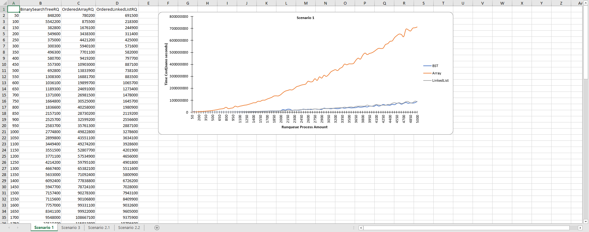
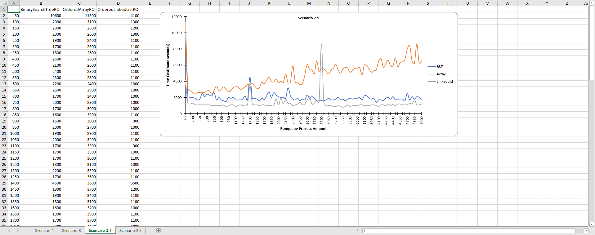

#Algorithms and Analysis COSC 1285
##Assignment 1: Process Scheduler

###Dev req:
JUnit5  
Apache POI 4.1.2 (located in the poi-4.1.2 dir)  

###Run the DataStructureEval  
It will automatically help you validate your Runqueue implementation and generate the corresponding graph and categorized by the scenarios.    
The output xlxs file is located at the src folder named with the test timestamp.  

